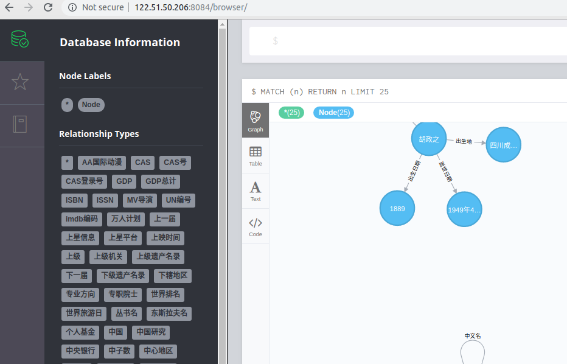
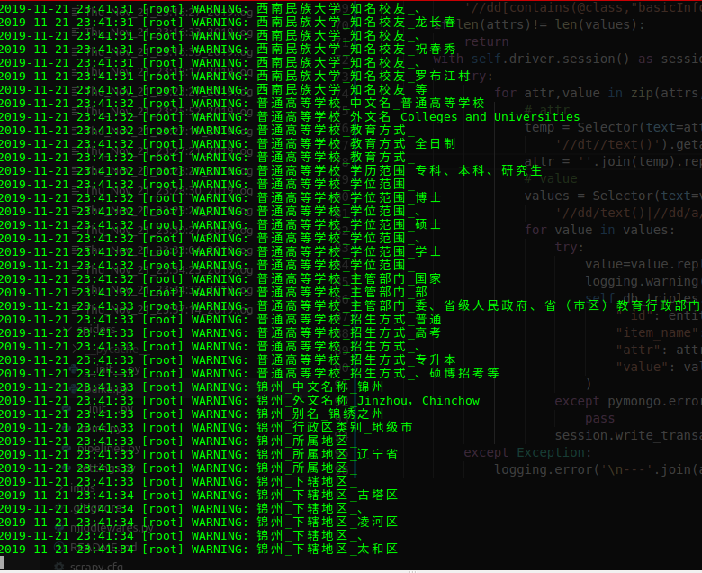
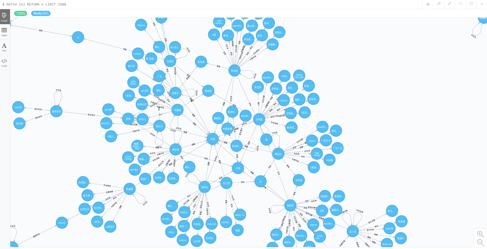
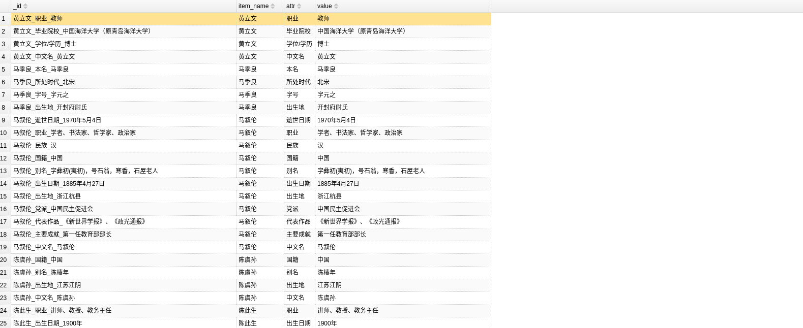
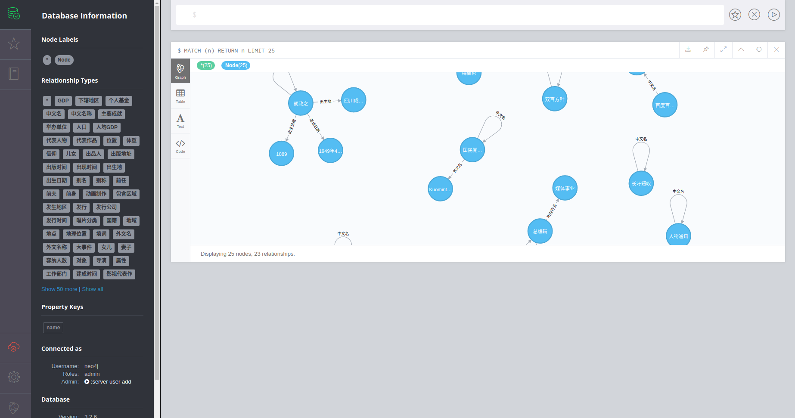

# 开源web知识图谱项目

- 爬取百度百科中文页面
- 解析三元组和网页内容
- 构建中文知识图谱
- 构建百科bot（构建中）

##### update 20191121

- 迁移代码到爬虫框架scrapy
- 优化了抽取部分代码
- 数据持久化迁移到mongodb
- 修复chatbot失效问题
- 开放neo4j后台界面，可以查看知识图谱成型效果

##### Tips

- 如果是项目问题，请提issue。
- 如果涉及到不方便公开的，请发邮件。
- ChatBot请访问[链接](http://bot.rubenxiao.com/)
- 成型的百科知识图谱访问[链接](http://kg.rubenxiao.com/)，用户名：neo4j,密码：123。效果如下：


### 环境

- python 3.6
- re:url正则匹配
- scrapy:网页爬虫和网页解析
- neo4j:知识图谱图数据库,安装可以参考[链接](http://blog.rubenxiao.com/posts/install-neo4j.html)
- pip install neo4j-driver：neo4j python驱动
- pip install pymongodb：mongodb的python支持
- mongodb数据库：安装参考[链接](https://docs.mongodb.com/manual/tutorial/install-mongodb-on-ubuntu/)


### 代码执行：

```
cd WEB_KG/baike
scrapy crawl baike
```

执行界面(按ctrl+c停止)：


### 知识图谱效果图



### mongodb存储的网页内容


### mongodb存储的三元组



### neo4j后台界面



